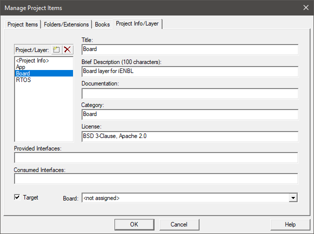
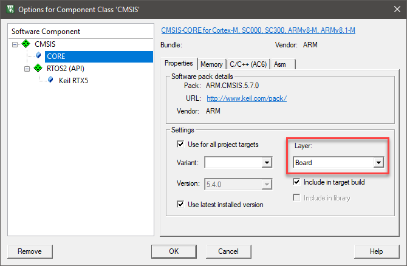

# Adding a Board to CB_Lab4Layer

This tutorial explains the required steps to be able to add a board layer for a specific development board to the [CB_Lab4Layer](https://github.com/MDK-Packs/CB_Lab4Layer) repository so that is can be used with the various application layers in CI tests. The steps are shown using the [iENBL](https://flex.com/resources/ienbl) rapid development platform from [Flex](https://flex.com/) but they can be easily adapted to any other development hardware.

## Prerequisites

- For creating layers, you require to have [CMSIS-Build](https://arm-software.github.io/CMSIS_5/Build/html/index.html) installed on your machine. The latest installer is available from the [GitHub repository](https://github.com/ARM-software/CMSIS_5/releases).
- Fork the [CB_Lab4Layer](https://github.com/MDK-Packs/CB_Lab4Layer) repository so that you can create a pull request.

## Creating Layers from a Working Project

Before you start to dissect the project into different layers, you first have to create it. Currently, the easiest way to do this is [Arm Keil MDK](https://www.keil.com/mdk) as this IDE supports the annotation of layers and the export to the open-source [CPRJ](https://arm-software.github.io/CMSIS_5/Build/html/cprjFormat_pg.html) project description format. The following assumes that you have created a project and that you can successfully build, download, and run it on your target hardware.

- In µVision, go to **Project - Manager - Project Items...** and select the **Project Info/Layer** tab.
- Enter the \<Project Info> and create the layers that your project is using (for example, *App*, *Board*, and *RTOS*). A detailed description can be found in the [µVision help - Project Information and Layers](https://www.keil.com/support/man/docs/uv4/uv4_ca_create_layers.htm). These layers will get software components assigned that are part of the respective layer:  
     
   Enable **Target** for the layer that will carry the information about the target device, usually the *Board* layer.
- Press **OK** to close the dialog.
- In the **Project** window, right-click on the project components and select **Options for...**. In the options dialog, assign the layer for the component, for example:  
  
- Press **OK** to close the dialog.
- Once all project items have been assigned to a layer, go to **Project - Export - Save Project to CPRJ Format**.  

## Extracting the Layers

- In the project directory holding the **CPRJ** file, open a Bash shell (for example [Git Bash](https://gitforwindows.org/)).
- [Source the CMSIS-Build setup](https://arm-software.github.io/CMSIS_5/Build/html/cbuild_install.html#cbuild_envsetup) in the Bash shell.
- Extract the board layer using `cbuildgen.exe project_name.cprj extract --layer=Board --output=Layer`
- Copy the `.\Layer\Board` folder into `.\CB_Lab4Layer\layer\Board\`
- Rename Board folder to your board name (for example `.\CB_Lab4Layer\layer\Board\iENBL`)
- If required, create a new file named `board_define` and add defines like the following: `export MYDEFINE=1`
- Create a new file called `layer.Board.md` and enter board specific information in there. This Markdown file will be used to create the overall README.md for an example project when created using CMSIS-Build.

The final folder structure in `.\CB_Lab4Layer\layer\Board\iENBL` must be as follows:
```
.\RTE
Board.clayer
board_define
layer.Board.md
Platform.iENBL.sct
```
Using this structure, you can now define layer combinations that can be used to create example projects.

## Defining Layer Combinations for Example Projects

Navigate to the `.\CB_Lab4Layer\build\` folder.

- Create a new file called `List.txt` and add the possible layer combinations. Below you'll find an example. Save and close the file.
  ```
  App=Blinky           Board=iENBL                            RTOS=RTX
  App=Blinky           Board=iENBL                            RTOS=FreeRTOS
  App=AWS_MQTT_Demo    Board=iENBL Module=ESP8266 Socket=WiFi RTOS=RTX
  App=AWS_MQTT_Demo    Board=iENBL Module=ESP8266 Socket=WiFi RTOS=FreeRTOS
  App=Azure_MQTT_Demo  Board=iENBL Module=ESP8266 Socket=WiFi RTOS=RTX
  App=Azure_MQTT_Demo  Board=iENBL Module=ESP8266 Socket=WiFi RTOS=FreeRTOS
  App=Google_MQTT_Demo Board=iENBL Module=ESP8266 Socket=WiFi RTOS=RTX
  App=Google_MQTT_Demo Board=iENBL Module=ESP8266 Socket=WiFi RTOS=FreeRTOS
  App=Paho_MQTT_Demo   Board=iENBL Module=ESP8266 Socket=WiFi RTOS=RTX
  App=Paho_MQTT_Demo   Board=iENBL Module=ESP8266 Socket=WiFi RTOS=FreeRTOS
  App=Watson_MQTT_Demo Board=iENBL Module=ESP8266 Socket=WiFi RTOS=RTX
  App=Watson_MQTT_Demo Board=iENBL Module=ESP8266 Socket=WiFi RTOS=FreeRTOS
  ```
- In the Bash shell execute: `$ ./gen_proj_list.sh List.txt --layer=../layer` in the `.\CB_Lab4Layer\build\` folder.

All listed projects must be generated successfully. When done, you can create a pull request in the CB_Lab4Layer repository so that your development board will be added to the repo.
