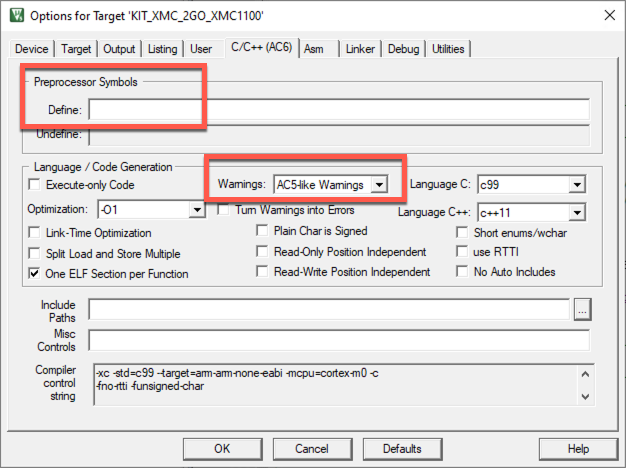
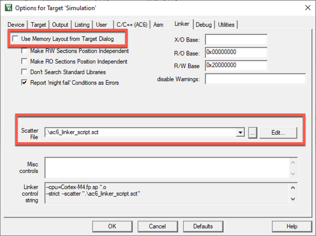

# CMSIS-Pack Migration Guide

This hands-on guide helps silicon vendors to migrate their CMSIS-Packs from legacy technologies like CMSIS v5 and Arm Compiler v5 to the latest and greatest.

Migrating includes two major tasks. First, you need to switch the [device support](#device-support) from assembly based startup files to C-based startup files. Also, you need to create scatter files as the C-based startup files rely on scatter files being present. Second, you need to convert the [example projects](#example-migration) to the new device support.

## Device support

This section explains how to move the device support from CMSIS v5 to CMSIS v6.

### Create C-based startup code

In CMSIS 6, assembly-based startup code is deprecated. You must move your `startup_device.s` files to `startup_device.c`. This sections explains the steps that you need to follow.

1. Copy the exemplary `startup_ARMCMx.c` file from the [CMSIS-DFP repo](https://github.com/ARM-software/CMSIS-DFP) into your device support repo. In this hands-on example, a Cortex-M4-based device is used ([startup_ARMCM4.c](https://github.com/ARM-software/CMSIS-DFP/blob/main/Device/ARMCM4/Source/startup_ARMCM4.c)).
1. Copy all the interrupt handler names and wrap them into `void handler_name (void) __attribute__ ((weak, alias("Default_Handler")));`. Place them around line 58 of the template file.

   **Code Example**
   ```asm
   ; Interrupt Handlers for Service Requests (SR) from Peripherals */
                   Entry   SCU_0_IRQHandler            ; Handler name for SR SCU_0     
                   Entry   ERU0_0_IRQHandler           ; Handler name for SR ERU0_0    
                   Entry   ERU0_1_IRQHandler           ; Handler name for SR ERU0_1    
                   Entry   ERU0_2_IRQHandler           ; Handler name for SR ERU0_2    
                   Entry   ERU0_3_IRQHandler           ; Handler name for SR ERU0_3     
                   Entry   ERU1_0_IRQHandler           ; Handler name for SR ERU1_0    
                   Entry   ERU1_1_IRQHandler           ; Handler name for SR ERU1_1    
                   Entry   ERU1_2_IRQHandler           ; Handler name for SR ERU1_2    
                   Entry   ERU1_3_IRQHandler           ; Handler name for SR ERU1_3    
                   DCD     0                           ; Not Available                 
                   DCD     0                           ; Not Available                 
                   DCD     0                           ; Not Available                 
                   Entry   PMU0_0_IRQHandler           ; Handler name for SR PMU0_0    
                   DCD     0                           ; Not Available                 
                   Entry   VADC0_C0_0_IRQHandler       ; Handler name for SR VADC0_C0_0  
                   Entry   VADC0_C0_1_IRQHandler       ; Handler name for SR VADC0_C0_1  
                   Entry   VADC0_C0_2_IRQHandler       ; Handler name for SR VADC0_C0_1  
                   Entry   VADC0_C0_3_IRQHandler       ; Handler name for SR VADC0_C0_3  
   ```
   
   Translates to:
   
   ```c
   void SCU_0_IRQHandler      (void) __attribute__ ((weak, alias("Default_Handler")));
   void ERU0_0_IRQHandler     (void) __attribute__ ((weak, alias("Default_Handler")));
   void ERU0_1_IRQHandler     (void) __attribute__ ((weak, alias("Default_Handler")));
   void ERU0_2_IRQHandler     (void) __attribute__ ((weak, alias("Default_Handler")));
   void ERU0_3_IRQHandler     (void) __attribute__ ((weak, alias("Default_Handler")));
   void ERU1_0_IRQHandler     (void) __attribute__ ((weak, alias("Default_Handler")));
   void ERU1_1_IRQHandler     (void) __attribute__ ((weak, alias("Default_Handler")));
   void ERU1_2_IRQHandler     (void) __attribute__ ((weak, alias("Default_Handler")));
   void ERU1_3_IRQHandler     (void) __attribute__ ((weak, alias("Default_Handler")));
   void PMU0_0_IRQHandler     (void) __attribute__ ((weak, alias("Default_Handler")));
   void VADC0_C0_0_IRQHandler (void) __attribute__ ((weak, alias("Default_Handler")));
   void VADC0_C0_1_IRQHandler (void) __attribute__ ((weak, alias("Default_Handler")));
   void VADC0_C0_2_IRQHandler (void) __attribute__ ((weak, alias("Default_Handler")));
   void VADC0_C0_3_IRQHandler (void) __attribute__ ((weak, alias("Default_Handler")));
   ```
3. Copy the list of names with the empty handlers to the `__VECTOR_TABLE_ATTRIBUTE` separated by commas (around line 99 in the template).

   **Code Example**
   Starting from the same assembly exception list as in the previous point, this translates to:
   ```c
   extern const VECTOR_TABLE_Type __VECTOR_TABLE[240];
          const VECTOR_TABLE_Type __VECTOR_TABLE[240] __VECTOR_TABLE_ATTRIBUTE = {
     (VECTOR_TABLE_Type)(&__INITIAL_SP),       /*     Initial Stack Pointer */
     Reset_Handler,                            /*     Reset Handler */
     NMI_Handler,                              /* -14 NMI Handler */
     HardFault_Handler,                        /* -13 Hard Fault Handler */
     MemManage_Handler,                        /* -12 MPU Fault Handler */
     BusFault_Handler,                         /* -11 Bus Fault Handler */
     UsageFault_Handler,                       /* -10 Usage Fault Handler */
     0,                                        /*     Reserved */
     0,                                        /*     Reserved */
     0,                                        /*     Reserved */
     0,                                        /*     Reserved */
     SVC_Handler,                              /*  -5 SVC Handler */
     DebugMon_Handler,                         /*  -4 Debug Monitor Handler */
     0,                                        /*     Reserved */
     PendSV_Handler,                           /*  -2 PendSV Handler */
     SysTick_Handler,                          /*  -1 SysTick Handler */
   
     /* Interrupts */
     SCU_0_IRQHandler,
     ERU0_0_IRQHandler,
     ERU0_1_IRQHandler,
     ERU0_2_IRQHandler,
     ERU0_3_IRQHandler,
     ERU1_0_IRQHandler,
     ERU1_1_IRQHandler,
     ERU1_2_IRQHandler,
     ERU1_3_IRQHandler,
     0,
     0,
     0,
     PMU0_0_IRQHandler,
     0,
     VADC0_C0_0_IRQHandler,
     VADC0_C0_1_IRQHandler,
     VADC0_C0_2_IRQHandler,
     VADC0_C0_3_IRQHandler
     /* Further interrupts are left out */
   };
   ```
4. Make sure that additional functions (for example for boot code) are implemented in C.
5. If you have conditional assembly, replace it with conditional compilation:

   **Code Example**
   ```asm
   IF (USE_CHIP=SOME_CHIP)
     DCD  WDT_IRQHandler
   ELSE
     DCD  _RESERVED
   ENDIF
   ```
   
   Translates to:
   
   ```c
   #if (USE_CHIP=SOME_CHIP)
   WDT_IRQHandler,
   #else
   0,
   #endif
   ```
6. If you have entries for stack and heap size in the assembly startup file, save these and add them in the next step to the now mandatory scatter file.

### Scatter file creation

1. Copy the scatter file template from the CMSIS-DFP into your device support repo. The one for the Cortex-M4 is called [ARMCM4_ac6.sct](https://github.com/ARM-software/CMSIS_5/blob/develop/Device/ARM/ARMCM4/Source/ARM/ARMCM4_ac6.sct).

2. Edit the template according to your device settings. These values need to be set:

```c
#define __ROM_BASE      0x00000000
#define __ROM_SIZE      0x00080000

#define __RAM_BASE      0x20000000
#define __RAM_SIZE      0x00040000

#define __STACK_SIZE    0x00000200
#define __HEAP_SIZE     0x00000C00
```

### CMSIS-Pack update

1. Make the necessary changes to your PDSC file. Exchange the startup_device.s file with the new startup_device.c file and add the device's scatter file as follows:

```xml
          <!-- startup / system / scatter files -->
          <file category="sourceC"      name="path/to/startup_device.c"      version="1.0.1" attr="config"/>
          <file category="linkerScript" name="path/to/device_ac6.sct" version="1.0.0" attr="config" condition="ARMCC6"/>
```

2. Finally, create a new pack with the updated device support so that you can migrate the projects to Arm Compiler 6.

## Example migration

The following assumes that your example is still using Arm Compiler 5. Thus, the project first needs to be migrated to Arm Compiler 6 before it can be automatically converted to the new CMSIS-Toolbox project standard (csolution/cproject).

1. Install the newly created device family pack in µVision.
1. Go to **Options for Target - Target** and set the `ARM Compiler` to *Use default compiler version 6*:
   
1. Go to the **C/C++ [AC6]** tab and set the appropriate defines. It is also good practice to set the compiler warnings to *AC5-like Warnings* as the new compiler is much more strict and may overwhelm with warning messages:
   
1. Copy the new scatter file from the device family pack into the project. Check if the project needs specific settings (you can compare against the original scatter file). Once done, go to the **Linker** tab and remove the checkmark at *Use Memory Layout from Target Dialog* and set the path to the new scatter file:
   
1. Once done, build the project to verify the correct operation. Afterwards, do not forget to add the updated example project to the CMSIS-Pack to make it available to your customers.

There are two documents available from Arm that help you in case you encounter any problems when migrating to Arm Compiler 6:
- [Migrate from ARM C/C++ Compiler 5 to ARM Compiler 6](https://developer.arm.com/documentation/kan298/latest) is a hands-on application note that explains all settings in µVision that are required for a successful conversion.
- Technical details are explained in the [Arm Compiler for Embedded Migration and Compatibility Guide](https://developer.arm.com/documentation/100068/latest/Migrating-from-Arm-Compiler-5-to-Arm-Compiler-for-Embedded-6).
