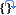

# Generic Debug Tutorial

The purpose of this tutorial is to introduce you to the powerful debug features of the μVision IDE. At the end of this tutorial, you will debug confidently with Arm Keil MDK.

## Why use Arm Keil MDK?

Arm Keil MDK provides these features particularly suited for Arm Cortex-M processor based devices:
1. μVision IDE with integrated debugger, Flash programmer and the Arm compiler toolchain.
1. Support for silicon vendor configuration tools.
1. Best-in-class Arm Compiler 6 (based on open-source LLVM) is included. GCC can be added manually.
1. [Dynamic syntax checking](https://www.keil.com/support/man/docs/uv4/uv4_ui_dynsyntax.htm) on C/C++ source lines.
1. [MDK-Middleware](https://www2.keil.com/mdk5/middleware) contains software stacks for TCP/IP networking, USB host and device, Flash file systems, and graphics.
1. Professional grade [Keil RTX5](https://www2.keil.com/mdk5/cmsis/rtx) included.
1. [Event Recorder](https://www2.keil.com/mdk5/debug/eventrecorder) for low-impact source code annotations.
1. Components for [functional safety](https://www2.keil.com/mdk5/safety/): compiler safety qualification kit and functional safety run-time system.
1. CoreSight Serial Wire Viewer and ETM trace capability on appropriately equipped devices.
1. Choice of debug adapters: ULINK family, J-Link, ST-Link, NXP MCU-LINK, and other third party adapters.

## CoreSight Definitions

1. **JTAG**: Provides access to the CoreSight debugging module located on the Cortex processor. It uses 4 to 5 pins.
1. **Serial Wire Debug (SWD)** is a two pin alternative to *JTAG* and has about the same capabilities except boundary scan is not possible.
1. **Serial Wire Viewer (SWV)** is a trace capability providing display of data reads/writes, exceptions, program counter (PC) samples and `printf`. SWV must use SWD because the JTAG signal TDO shares the same pin as SWO. Alternatively, SWV data can come out of the *Trace Port*.
1. **Serial Wire Output (SWO)** pin provides access to *SWV* frames. It shares the JTAG signal TDO.
1. **Trace Port** is a 4-bit port that [ULINKpro](https://www2.keil.com/mdk5/ulink/ulinkpro) uses to collect *ETM* frames and optionally SWV (rather than SWO pin).
1. **Debug Access Port (DAP)** is a component of the Arm CoreSight debugging module that is accessed via the JTAG or SWD port. One of the features of the DAP are the memory read and write accesses which provide on-the-fly memory accesses without the need for processor core intervention. μVision uses the DAP to update Memory, Watch, Peripheral and RTOS kernel awareness windows while the processor is running. You can also modify variable values on the fly. No CPU cycles are used, the program can be running and no code stubs are needed. You do not need to configure or activate DAP. μVision configures DAP when you select a function that uses it. Do not confuse this with CMSIS-DAP which is an Arm on-board debug adapter standard.
1. **Instrumentation Trace Macrocell (ITM)** can be used for `printf` type debugging.
1. **Embedded Trace Macrocell (ETM)** displays all instructions executed by the processor. This enables code coverage and performance analysis. ETM is output on the Trace Port (requires a special 20-pin CoreSight connector) or accessible in the *ETB* (no code coverage or performance analysis support).
1. **Embedded Trace Buffer (ETB)** is a small amount of internal RAM used as an ETM trace buffer. This trace does not need a specialized debug adapter such as a ULINKpro. ETB runs as fast as the core but is not available on all processors. See your specific datasheet.
1. **Micro Trace Buffer (MTB)** is a portion of the device's internal user RAM that is used for an instruction trace buffer. Only available on Cortex-M0+ processors. Armv7-M/Armv8-M based processors provide *ETM* trace instead.
1. **Hardware Breakpoints**: Armv6-M based devices have two HW breakpoints, while Armv7-M/Armv8-M based ones usually have six. These can be set/unset on-the-fly without stopping the processor. They are no skid: they do not execute the instruction they are set on when a match occurs. The CPU is halted before the instruction is executed.
1. **Watchpoints** are conditional breakpoints. They stop the program when a specified value is read and/or written to a specified address or variable. There also referred to as Access Breaks in Keil documentation.

*Note:*

Armv6-M based devices may have only features 2) and 4) plus 10), 11), and 12) implemented. Armv7-M based devices can have all features listed implemented. It is possible some processors have all features except ETM Instruction trace and the trace port. Consult your specific datasheet.

## Basic Run/Stop Debugging

### Prerequisites

Most of the following debug tips will work in µVision using the built-in simulator. Where this is not possible, it is stated explicitly. A simple [blinky example project](./project/blinky.zip) is provided with this application note. Copy it to to your computer, unzip it, and  **build (F7)** the example project.

### Hardware Breakpoints

1.  **Start a Debug Session (Ctrl+F5)** to enter the µVision debugger.
1.  **Run (F5)** the application.
1. Bring `blinky.c` in focus by clicking on its tab. If it is not visible, double-click on it in the **Project** window.
3. In `blinky.c`, scroll down to inside the `main` function to the `while (1)` loop found starting near line 42 as shown here:  

4. Note on the left of the line numbers are darker grey blocks. This indicates there is assembly code present and you can set a hardware breakpoint on these lines. You can also see these blocks in the Disassembly window:  

5. While the program is still running, click to the left of a suitable line in the `while` loop and a red circle will be created. This is a hardware breakpoint. The simulated Arm Cortex-M4 has eight hardware breakpoints. μVision will warn you if you exceed this limit.
6. The program will soon stop at the line where you set the breakpoint on as shown below. The yellow arrow is the current program counter position. This will be the next instruction executed. The cyan arrow is a placeholder you can use to explore the relationship between a source window and the **Disassembly** window.  

7. Add another breakpoint in `while (1)` or in a suitable place in `blinky.c`.
8. Each time you click on  **Run (F5)**, the program will cycle to the next breakpoint.

*Tips:*

- You can set/unset hardware breakpoints with μVision while the program is running or stopped.
- Arm hardware breakpoints are no skid. They do not execute nor change the instruction they are set to.

*Note:*

- Sometimes the compiler will optimize out code. Breakpoints cannot be set on this code as evidenced by the lack of the grey blocks. Setting the compiler to an optimization level of `-O0` will usually help.

#### Managing Breakpoints

1. Go to **Debug - Breakpoints (Ctrl-B)** to manage breakpoints:  

2. You can temporarily unselect, delete or create breakpoints in this window. It is easier to create a breakpoint by clicking in a source file or the **Disassembly** window.
3. [Watchpoints](#watchpoints) are also created in this window.
4. Select **Kill All** to remove all breakpoints.
5. Click **Close**.
6. Continue to  **Run (F5)** for the next exercise.

### Call Stack + Locals Window

The **Call Stack + Locals** window displays call stack contents as well as any local variables belonging to the active function.  
If possible, the values of the local variables will be displayed. If this is not possible, a message such as `<not in scope>` will be displayed. The **Call Stack + Locals** window visibility can be toggled by selecting **View - Call Stack window**.

1. Stop the program with the  **Stop** icon. The program will probably stop in the `Delay` function.
2. Click on the **Call Stack + Locals** window in the bottom right corner of μVision.
3. Inspect the various entries in the Call Stack + Locals window as shown below right in this very simple example. Local variables are displayed only when they are in scope:  

1. Set a breakpoint in the `while (1)` loop at line 50 on the `g_ledSet = 1;`.
5.  **Run (F5)** the application.
6. Shortly after, the program will stop there.
1.  **Step (F11)** with blinky.c in focus (its name in its tab is underlined).
9. Note how the variables displayed change in the **Call Stack + Locals** window.
1.  **Step (F11)**  a few more times.
1. Remove the **Breakpoint** to continue.

*Tips:*

- You can also use  **Step Out (Ctrl+F11)** to exit a function. This is will be indicated in the **Call Stack + Locals** window.
- This is standard “run/stop” debugging. Arm CoreSight debugging technology can do much better than this. You can display global or static variables and structures updated in real-time while the program is running. No additions or changes to your code are required. They only must be converted to global or static variables so they always remain in scope.
- Single  **Step (F11)**: If you click inside a source window to bring it into focus, the program will step one source line at a time. If you click inside the **Disassembly** window to bring it into focus, it will then step one instruction at a time.

**Call Stack Use Case**

The list of stacked functions is displayed when the program is stopped. This is when you need to know which functions have been called and are stored on the stack. This is useful to find program flow problems such as crashes.
Normal functions are displayed only when they are on the stack. They are removed and added as appropriate. When Keil RTX5 is used, the threads are always displayed, even if not running. The active thread name and its number are highlighted in green.

### Watch and Memory Windows

The **Watch** and **Memory** windows display updated variable values in real-time. They do this using Arm CoreSight DAP debugging technology. It is also possible to “put” or insert values into these memory locations in real-time using the **Memory** window while the program is running. You can change memory in a **Watch** window if data is not changing fast.
There is a global variable `g_msTicks` located in `blinky.c` near line 11 we can use in the **Watch** and **Memory** windows.

#### Watch Window

1.  **Run (F5)** the application.
2. Right click on `g_msTicks` in `blinky.c` near line 11 and select **Add 'g_msTicks' to…** and select **Watch 1**.
3. Go to **View** in the main menu and enable **Periodic Window Update**:  

4. `g_msTicks` will be displayed in **Watch 1**:  

5. The values of `g_msTicks` are updated in real-time if *Periodic Window Update* is enabled.
6. You can modify the value in a **Watch** window when the program is stopped or changing slowly. You can modify a variable in a **Memory** window anytime (see next section).

**Adding the SystemCoreClock Variable**

*Tip:* You do not need to stop the program execution to enter variables, raw addresses or structures in a **Watch** or **Memory** window.

1. Click on `<Enter expression>` twice and enter: `SystemCoreClock`
2. Right click on the `Value` and deselect **Hexadecimal Display**. 25 MHz will be displayed:


#### Memory Window

1. Right click on `g_msTicks` and select **Add ‘`g_msTicks` ' to…** and select **Memory 1**.
2. Note the changing value of `g_msTicks` is displaying its address in **Memory 1** as if it is a pointer. This is useful to see what address a pointer is pointing to. But this not what we want to see at this time.
3. Right click in **Memory 1** and select **Unsigned Long** to see the data field as 32-bit numbers.
4. Add an ampersand `&` in front of the variable name `g_msTicks` and press Enter. Now the physical address is shown (0x2000_0008) in this case. This physical address could change with different compilation optimizations.
5. The data contents of `g_msTicks` is displayed as shown:

6. Right click on the memory data value and select **Modify Memory at 0x20000008**. Enter a value and this will be pushed into `g_msTicks`. Since `g_msTicks` is updated often, you will only see the new value displayed for a very short time.
7.  **Stop** the application.

*Tips:*
- You can configure the Watch and Memory windows while the program is running in real-time without stealing any CPU cycles. You can change a Memory window value on-the-fly.
- **View - Periodic Window Update** must be selected. Otherwise variables update only when the program is stopped.

**How It Works**

μVision uses Arm CoreSight technology to read or write memory locations without stealing any CPU cycles. This is nearly always non-intrusive and does not impact the program execution timings. The Armv7-M/Armv8-M are Harvard architectures. This means they have separate instruction and data buses. While the CPU is fetching instructions at full speed, there is plenty of time for the CoreSight debug module to read or write to memory without stealing any CPU cycles.  
This can be slightly intrusive in the unlikely event the CPU and μVision reads or writes to the same memory location at exactly the same time. Then the CPU will be stalled for one clock cycle. In practice, this cycle stealing never happens.  
Remember you are not able to view *local variables* while the program is running. They are visible only when the program is stopped in their respective functions. You must change them to a different type of variable such as global to see them update.

### System Viewer

System Viewer provides the ability to view certain registers of peripherals and the CPU core. In many cases, these windows are updated in real-time while your program is running. They are available only while in debug mode. Go to **Peripherals - System Viewer** to open the peripheral windows (not available in simulation). Select CPU core registers by going to **Peripherals - Core Peripherals**.

As there are no simulated system peripherals, refer to the [System Viewer](https://www.keil.com/support/man/docs/uv4/uv4_db_dbg_systemviewer.htm) for more information.

**SysTick Timer**

The example application uses the Arm Cortex-M system tick timer.

1.  Go to **Peripherals - Core Peripherals** and then select **SysTick Tick Timer (SysTick)**.
1.  **Run (F5)** the application.
2. The **SysTick Timer** window opens:  

3. Note it also updates in real-time while your program runs using CoreSight DAP technology.
4. Note the `SysTick -> LOAD` register. This is the reload register value. This value is set in `os_systick.c` at line 72:  
`  SysTick->LOAD =  load;`
5. Note `SysTick -> RELOAD` is set to 0x0061A7 = dec 24,999. This is created by (25 MHz/1000)-1 = 24,999. 1000 is specified as the timer tick value. A SysTick S interrupt 15 will occur every 1 msec. Changing the reload value changes how often the SysTick interrupt 15 occurs.
6. In the `SysTick -> LOAD` register in the **SysTick** window, while the program is running, type in `0x10000` and click in another register or press Enter.
7. The program execution will speed up. This is the power of Arm CoreSight debugging.
8. Replace RELOAD with 0x0061A7. A STOP and CPU RESET will also accomplish this.
9. When you are done, stop the application and close the **SysTick Tick Timer (SysTick)** window.

*Tip:* As you can modify values in the System Viewer while the program is running, you can make slight timing value changes instead of the usual modify, compile, program, run cycle.

You must make sure a given peripheral register allows for and will properly react to such a change. Changing such values indiscriminately is a good way to cause serious problems that are difficult to find.

### Watchpoints

Most Armv7-M and Armv8-M based processors have four data comparators. Since each **Watchpoint** uses two comparators, you can configure two of them. Watchpoints can be thought of as conditional (access) breakpoints. The Logic Analyzer uses the same comparators in its operations. This means in μVision you must have two variables free in the [Logic Analyzer](#using-the-logic-analyzer) to use Watchpoints. Currently, μVision supports only one Watchpoint.

**Configure Watchpoint**

1. Using the example from the previous page, RUN or STOP the program, but stay in debug mode.
2. Go to **Debug - Breakpoints (Ctrl-B)** to open the **Breakpoints** window.
3. In the **Expression** box, enter g_msTicks==0x44.
4. Select both the **Read** and **Write Access**.
5. Click on **Define** and it will be accepted as shown here:  

6. Click on Close.
7.  **Run (F5)** the application.
8. When `g_msTicks` equals `0x1` the program will halt. This is how a Watchpoint works.
9. You will see `g_msTicks` displayed with a value of 0x44 in the Watch window:

10. Delete the Watchpoint by selecting **Kill All** in the **Breakpoints** window or use  **Kill all Breakpoints in Current Target**.
11. Select Close.
12. Leave Debug mode.

**Using the Watchpoint in the Stack Space**

If you put a RAM address as the expression with no value, the next read and/or write (as you selected) will cause the program to halt. This can be particularly useful in the Stack. Set an address at some limit and if the program reads or writes this address, the program stops.

1. In this example a Watchpoint is created with address `0x2000_0008`.
2. Running the program, the first read or write will stop the processor.
3. The **Command** window shows the setting of this Watchpoint and its execution including the approximate instruction location:


*Tips:*

- Skid: The instruction noted will not be the instruction causing the break as it has not been executed yet. It will be noted in **Disassembly**.
- The instruction causing the break is probably a few instructions before this one in the execution stream.
- To edit a Watchpoint, double-click on it in the Breakpoints window and its information will be dropped down into the configuration area. Clicking on **Define** will create another Watchpoint. You should delete the old one by highlighting it and click on Kill Selected or use the following tip.
- The checkbox beside the expression in Current Breakpoints as shown above allows you to temporarily unselect or disable a Watchpoint without deleting it.
- You can create a Watchpoint with a raw address and no variable value. This is useful for detecting stack overruns. Physical addresses can be entered as `*((unsigned long *)0x20000000)`. Or simply enter the address as shown above.

## Debugging using Event Recorder

### printf without a UART

μVision provides a simple `printf` utility using the Event Recorder. It does not require a UART and it is much faster. It also and takes less code than a standard UART or USB COM port. Text is displayed in the **Debug (printf) Viewer** window as shown below.

Event Recorder (EVR) can be used to instrument your code for any Cortex-M based device. Keil RTX5, MDK-Middleware and CMSIS-FreeRTOS are already instrumented with Event Recorder. It only uses memory reads and writes, so essentially the same technology used in **Watch**, **Memory** and **Peripheral** windows. It is supported by all debug adapters (including CMSIS-DAP).

**Configure Event Recorder**

1. If it is running, stop the program and exit debug mode (Ctrl+F5).
2.  Go to **Project - Manage - Run-Time Environment**.
3. Expand **Compiler** and enable **Event Recorder:DAP** and **I/O:STDOUT:EVR** as shown:

5. The **Validation Output** window should be empty. If not, click on the **Resolve** button to enable other missing software components.
7. Click **OK** to close this window.
8. `retarget_io.c`, `EventRecorder.c`, and `EventRecorderCOnf.h` will be added to your project under the **Compiler** group in the **Project** window:  

9. Right click near the top of `blinky.c`, at line 7 and select **Insert '#include file'** and select `#include "EventRecorder.h"`.
10. In the main() function near line 39 just after `SystemCoreClockUpdate();`, add this line:  
    `EventRecorderInitialize(EventRecordAll,1);`
11. In the next line, add:  
    `EventRecorderStart();`

**Use Event Recorder**

Now, create a global variable named `counter` whose value will be printed on **Debug (printf) Viewer** window.

1. In blinky.c, near line 14, declare the global variable counter:  
   `uint32_t counter = 0;`
2. Add these two lines just after the `Delay(1000)` statement at line 46:  
   ```c
   counter++;
   if (counter > 0x0F) counter = 0;
   ```
1. Add `#include "stdio.h"` near the top of the file near line 8.
2. Near/at line 48 just after the statement `if (counter > 0x0F…`, add:  
   `printf("Hello %d\n", counter);`
3. Go to  **File - Save All**.
3. Go to  **Project - Build Target (F7)**.
1.  **Start a Debug Session (Ctrl+F5)** to enter the µVision debugger.
1.  **Run (F5)** the application.
3.  Go to **View - Serial Windows** and select **Debug (printf) Viewer**.
4. The values of counter are displayed as seen here:  
   
5. Go to **View - Analysis Windows** and select **Event Recorder** to see information about the printf statements:  
   
8. Stop the program and exit the debug mode **(Ctrl+F5)**.

### Running EVR in Non-initialized Memory

In the **Command** window, you will see `Warning: Event Recorder not located in uninitialized memory!`. This can be safely ignored for the purpose of this tutorial.

It can be important to preserve the EVR data located in target RAM memory in the event of a crash and/or reset. Creating and using non-initialized memory is implemented by modifying the scatter file.
[Knowledge base article 4012](https://www.keil.com/support/docs/4012.htm) explains how to modify your project to do so.

### Code Annotation with Event Recorder

With Event Recorder, you can annotate your source code which can be displayed in various information windows. It only uses CoreSight DAP to output data from the target (memory reads/writes). This means any debug adapter can be used. MDK-Middleware, Keil RTX5, and CMSIS-FreeRTOS are already annotated. [Event Recorder EVR](https://www.keil.com/support/man/docs/uv4/uv4_db_dbg_evr.htm) requires a certain amount of system RAM.

**Configure Event Recorder**

1. Confirm that the *Configure Event Recorder* steps in the previous section were completed.
1. To add an event, insert this function call just before Delay(1000U) around line 45:  
   `EventRecord2(3, 44, counter);`
3. Go to  **File - Save All**.
3. Go to  **Project - Build Target (F7)**.
1.  **Start a Debug Session (Ctrl+F5)** to enter the µVision debugger.
5. Go to **View - Analysis Windows** and select  **Event Recorder** to see the event coming in.
1.  **Run (F5)** the application.
5. Events will start to display in the **Event Recorder** window as shown below:  
   
6. You can see the results of the `EventRecord2(3, 44, counter);` event.
7. `printf` frames (stdout) are also displayed with the printf data in hexadecimal form.
9. Stop the recording by unselecting **Enable** in the upper left corner.
10. When you re-enable it, events that were collected in the background as the program ran will be displayed.

*Tip:*

- Hover your mouse over **Event Property** entries to gain more information.

### Determining Relative Timing Values

1. Unselect **Enable** in the Event Recorder window to stop the collection of data.
2. Right-click on the first in a sequence of stdout frames and select **Set Time Reference**. The selected frame will turn from blue to green.
4. Position your mouse pointer on the **Time (sec)** column on the next event frame.
5. A box will open displaying the elapsed time. It took about one second from the start of this printf to the next one:  
   
6. Enable the Event Recorder so the frames continue to be captured and displayed.
7. You can use this feature to time many different events in your code.

*Tips:*

- Using event annotations provides a useful time link to your source code.
- Using printf with a 9600 baud UART with 8 characters uses about 80,000 CPU cycles or about 8 msec. Using Event Recorder is much faster taking only ~ 500 cycles. Event Recorder is 10 times faster than a UART running at highest speeds. Using an Event such as StartB(1) with 8 bytes is even faster: only ~250 CPU cycles.

### Filtering the Event Recorder Window

It is possible to filter the window contents. Modify the information displayed in the Event Recorder window using the funnel icon which will open the **Show Event Levels** window. You can specify what elements are collected and displayed in the Event Recorder window.

1. Stop the program if necessary but stay in debug mode.
2. In the Event Recorder window, select  **Configure Target Event Recording**. The **Show Event Levels** window opens up:  
   
3. Unselect all boxes opposite STDIO as shown above.
4. Click **OK** to close this window.
5. Click  **Clear** to make it easier to see what is happening.
1.  **Run (F5)** the application.
7. The Event Recorder window no longer contains printf frames as shown below:  
   
In this case, you only need to unselect the Op column. The other frames do not exist in our simple example.

**Saving the Filter Settings**

You can [save and recall](https://www.keil.com/support/man/docs/uv4/uv4_cm_er.htm) the filter settings. In the **Command** window, enter:
```
ER SAVE path\filename
ER LOAD path\filename
```

### Event Statistics

You can add start and stop events to your source code to collect information about execution counts and times. If you are using a ULINKplus debug adapter, information can also include voltage, current and total charge (Q) consumed. Individual and aggregate times are provided. This information will be collected between the start and stop event tags including the execution of any exception handlers or program branches.

- **Start:** The basic function call is EventStartX(slot) and EventStartX(slot, v1, v2)
- **Stop:** The basic function call is EventStopX(slot) and EventStopX(slot, v1, v2)
- These calls are arranged in four groups (X = A, B, C, D). v is for data value.
- Each group has 15 slots (0 to 15). Stop events for slot = 15 creates a global stop for all slots of a group.
- Examples:  
  ```c
  EventStartA(2);
  EventStopA(2);
  EventStartB(4,34, counter);
  ```
**Set Core Clock for Timing Measurements**

For correct timing information when working with real hardware, the core clock needs to be set up correctly.

*Note:*

The following is not required in simulation!

1. Go to  **Project - Options for Target... (Alt+F7)** and select the **Debug** tab.
2. Select the **Settings** icon to the right of this window.
3. Select the **Trace** tab.
4. Enter the correct value **Core Clock:**. μVision uses this Core Clock: setting to calculate timing values displayed in some windows.
5. Click **OK** twice to return to the main μVision menu.

**Add the EventStart and EventStop Events**

1. Stop the program if running and exit debug mode (Ctrl+F5).
2. Add this line near line 45:  
   `EventStartA(11);`
3. Add this line near line 48:  
   `EventStopA(11);`
3. Go to  **File - Save All**.
3. Go to  **Project - Build Target (F7)**.
1.  **Start a Debug Session (Ctrl+F5)** to enter the µVision debugger.
5. Go to **View - Analysis Windows** and select  **Event Statistics** to see the event coming in.
1.  **Run (F5)** the application.
4. The **Event Statistics** window displays timing data between the start and stop function calls:  
   
5. Event Group A is displayed, slot 11 as indicated.
6. The execution time statistics are displayed for minimum, maximum, and average execution times (do not differ in simulation). This makes it easy for you to determine these statistical values for locations in your sources.

This provides a good method to determine timings relative to your source code. Event Statistics is easy to configure and interpret. You can create up to 64 start/stop events.

*Tips:*

- Refer to [Event Statistics Window](https://www.keil.com/support/man/docs/uv4/uv4_db_dbg_evr_stat.htm) for an in-depth explanation of this window.
- Refer to [Event Recorder](https://www.keil.com/support/man/docs/uv4/uv4_cm_er.htm) to learn how to save Event Statistics information.

## Debugging using Serial Wire Viewer (SWV)

**Serial Wire Viewer (SWV)** provides program information in real-time and is extremely useful in debugging applications. SWV is used to display data reads and writes and exceptions which include interrupts and more.

SWV is not supported in simulation mode. For SWV a debug adapter connected to real target hardware is required. 

### Prerequisites

μVision must be running in edit mode and the project must be loaded. The hardware must be connected to the PC.

**Configure the Target Driver Setup to use Serial Wire Viewer**

1. Go to  **Project - Options for Target... (Alt+F7)** and switch to the **Debug** tab.
2. On the right-hand side, select you debug adapter and click on the **Settings**. The **Target Driver Setup** window opens.
3. Select the **Trace** tab:  
   
4. In **Core Clock:** enter the correct core clock of your target device. This value will be used for calculating timing values.
5. If your device runs a different trace clock, you might need to unselect **Use Core Clock** and enter the correct trace clock speed. The SWO clock speed will be calculated from this. This value is crucial for a ULINK2/ULINKplus or J-Link as a UART is used. ULINKpro does not use this for the connection.
4. Select Trace Enable. 
7. Confirm that **EXCTRC: Exception Tracing** is selected. The enables exceptions (including interrupts) to be output to the μVision debugger for display.
8. SWV is now configured and ready to use.
10. Click **OK** twice to return to the main μVision menu.

*Tips:*

- For details determining the core clock speed refer to [App Note 207](https://www.keil.com/appnotes/docs/apnt_297.asp).
- μVision uses the core clock value to calculate various timing displays even if SWV is not used. If the times displayed in various windows are incorrect, check these settings.

### Displaying Exceptions and Interrupts in the Trace Exceptions Window

1.  **Start a Debug Session (Ctrl+F5)** to enter the µVision debugger.
5. Go to **View - Trace** and select **Trace Exceptions**.
1.  **Run (F5)** the application.  
3. In this window, click on the Count column name to bring 15 SysTick into view:  
   
4. The values are updating while the application runs. Unselect EXCTRC: box to stop the updates.
5. Various statistics are displayed. Any other active exceptions will automatically be displayed (not in this example).
6. *Period*=14.13/14122 = 1 ms. Thus, the SysTick is generating an interrupt every millisecond.

### Displaying Exceptions and Interrupts in the Trace Data Window

5. Go to **View - Trace** and select **Trace Data**.
1.  **Run (F5)** the application and stop is after a little while.
3. The **SysTick** exception is shown in Trace Data:  
   
5. It is displayed with Entry, Exit and Return points:  
   **Entry**: when the exception or interrupt is entered.  
   **Exit**: when the exception or interrupt exits.  
   **Return**: when all exceptions or interrupts exit. This indicates that no Cortex tail chaining is occurring. 

### Using the Logic Analyzer

μVision has a graphical **Logic Analyzer (LA)** window. Up to four variables can be displayed in real-time using Serial Wire Viewer. Logic Analyzer data points occur when the events happen with each data write and not periodically like the **Watch** or **Memory** windows. If an SWV overload occurs, turn off unnecessary SWV features. You could sample the data writes with another variable and then display it. The idea is to reduce SWO traffic to prevent overflows and data loss.

The LA shares the comparators in CoreSight with the [Watchpoints](#watchpoints). They are mutually exclusive.

1. In the µVision debugger, right-click on any occurrence of the `counter` variable in blinky.c and select **Add ‘counter’ to …** and select **Analyzer**. The LA will open.
3. In the LA, click on **Setup**. In **Display Range** set **Max:** to 0x0F. Click on **Close**. The LA is now configured. You can also configure LA while the program is running.
4.  **Run (F5)** the application. 
5. `counter` will still be visible in Watch 1 but also shown in LA:  
   
6. Adjust the Zoom using **Out** or the **All** icon in the LA to provide a suitable scale. If no waveform is displayed in the LA, exit and re-enter debug mode to refresh the comparators.
7. Enable **Amplitude**, **Signal Info** and **Cursor** in the LA window.
8. Select  **Stop** in the Update Screen to stop the LA from collecting data. The program keeps running.
9. Click on a spot in the LA and position the mouse to demonstrate the method used to measure
timing values:  
   

*Tips:*

- When you enter a variable in the Logic Analyzer window, it is also displayed in the Trace Records (or Trace Data for ULINKpro). A ULINK2, ULINKplus or ULINKpro displays the Data Writes. J-Link does not. ULINKplus and ULINKpro also displays any LA waveforms in  [System Analyzer](#full-system-analysis-with-system-analyzer) window.
- If no waveform is displayed in the LA, exit and reenter Debug mode to refresh the comparators.
- If a waveform jagged, this can be from overloads in the SWO pin. Solutions are getting a faster debug adapter such as ULINKplus or ULINKpro. Turning off various SWV signals such as EXCTRC that are not needed can help. A Keil ULINKpro has the ability to receive SWV frames out the 4 bit + clock Trace Port instead of the 1 bit SWO pin like the other adapters which has significantly greater data throughput.
- The Logic Analyzer can display static and global variables, structures and arrays. It can’t see locals: make them static or global. To see peripheral registers, enter their physical addresses into the Logic Analyzer and read or write to them. Physical addresses can be entered as:  
`*((unsigned long *)0x20000000)`.
- An error message saying `counter` cannot be added usually means SWV is not configured or `counter` is not in focus.

### Full System Analysis with System Analyzer

System Analyzer can display much information depending on which Cortex-M processor and debug adapter you are using. Use a ULINKplus to get the most out of System Analyzer. Data reads and writes, exception/interrupt events and more are displayed. ULINKplus and ULINKpro provide this information as well as a measured core clock value with ULINKplus. In this example, Event Recorder frames, [Logic Analyzer](#using-the-logic-analyzer) `counter` and SysTick interrupts are displayed.

1. Go to **View - Analysis Windows** and select  **System Analyzer**.
1.  **Run (F5)** the application for a little while. The values are updating while the application runs. User the lock icon to stop the updates.
3. In the window, use the scroll wheel of your mouse to zoom in on **SysTick(15)** in the **Exceptions** section.
4. Use the green and red markers to verify that the SysTick interrupts are one millisecond apart and that the `counter` variable value is shown in the **Data Watch** section:  
   
4. Depending on the debug adapter you are using, you can also verify the correct **Core Clock** setting under **System**. ULINKplus is capable of measuring this value while the application is running.

**Where are the other Events and printf?**

These events are there. In this simple program these events are occurring very close together. If you expand the X axis further, the events will be displayed as shown here:  
     
You can activate the cursors and make various timing measurements.

*Tips:*

- You can measure the period between the interrupts and how long the handler took to execute. This is very useful to confirm interrupts are executing as designed.
- Use the column icon to align the waveforms.

## Power Measurement with ULINKplus

An Arm Keil ULINKplus debug adapter measures the CPU core clock and adds power measurement.

*Tip:*

- For details on how to connect the ULINKplus to your board to measure power, refer to the [quickstart page](https://www2.keil.com/mdk5/ulink/ulinkplus/quickstart) and the [documentation](https://www.keil.com/support/man/docs/ulinkplus/ulinkplus_measuring_power.htm).

Once the hardware connection is done, you need to configure the debug adapter.

**Configure ULINKplus with an Initialization File**

Configure ULINKplus using a set of debug commands. A [debug script template called Debug_UlinkPlus.ini](https://www.keil.com/support/man/docs/ulinkplus/ulinkplus_debug_script_template.htm) is available as a reference. Such a script is usually executed when debug mode is entered. This file is available in your tool installation: C:\\*installation_path*\ARM\ULINK\Templates.

1. Copy this file into your project directory (where the `*.uvprojx` file is located).
1. Go to  **Project - Options for Target... (Alt+F7)** and switch to the **Debug** tab.
6. Click on **...** in the **Initialization File:** box, and add the file:  
   
6. Click **Edit...** to open the file.
9. Click **OK** to close the target options window and return to the main μVision window.
1. Click on the **Configuration Wizard** tab at the bottom of `Debug_UlinkPlus.ini` window.
1. Enable **ULINK Power Measurement** and select the value of your shunt resistor (in this case 2.55 Ohm/100 mA:  
   
3. Go to  **File - Save All**.

ULINKplus is now configured and ready to use.

### Measure Power in System Analyzer

1.  **Start a Debug Session (Ctrl+F5)** to enter the µVision debugger.
1.  **Run (F5)** the application.  
1. If the window is not already open, go to **View - Analysis Windows** and select  **System Analyzer**.
6. Click the lock symbol to stop the data collection.
9. You can Zoom in or out with or your mouse wheel. First click in the waveform to set an anchor point.
5. You will have a window similar to the one below:
   

The **Current** and **Voltage** waveforms are shown in the **Consumption** section.

*Tips:*

- If **Current** has negative values, reverse the shunt wires.
- The **Voltage** and **Current** Y axis numbers are adaptive and will change dynamically to suit the values displayed.

### Power Consumption in the Event Statistics Window

1. Go to **View - Analysis Windows** and select  **Event Statistics** to open the window:  
   

The various statistics are displayed and updated in real-time. Timings, voltage, current and charges consumed are recorded according to Groups and Slots. These are created by the `EventStartX()` and `EventStopX()` function calls in the application code.

### Energy Measurement without Debug

The CoreSight debug components consume some amount of power. This will be reflected in the System Analyzer window. To be able to measure the real-life power without a debug connection, a specific debug mode is available. In this more, you will not be able to relate the waveforms with your code. The effects will be most pronounced during processor Sleep and WAIT states when the current drops to very low values.

1. **Stop a Debug Session (Ctrl+F5)** to leave the µVision debugger.
1. Go to  **Debug - Energy Measurement without Debug**.
2. The debug session starts and you can  **Run (F5)** the application as usual.
4. System Analyzer will display the waveform as shown below:  
     
   Any features needing CoreSight will not be available.
