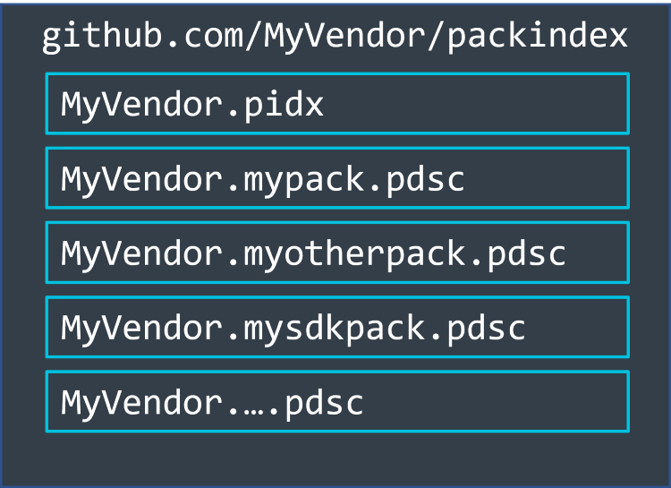
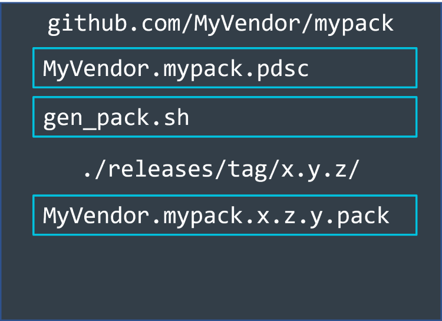

# Publishing Packs

This document describes how to publish a pack on various platforms.

## Hosting on GitHub

This section explains how to host a pack using a GitHub repository.

### Pack index repository

If you plan to create multiple packs, we recommend to use a pack index file (PIDX) for making all packs available for
an indexing infrastructure at once. The PIDX file allows you to change pack versions and add packs to your distribution list. All packs referenced in the PIDX file will be processed and validated by the indexing service. Only packs that pass the checks will become available via web pages and development tools.

To host this PIDX file, create a separate repository on GitHub within your organization (here called `MyVendor`), for example https://github.com/MyVendor/packindex.



This repository should contain:

- Your organization's PIDX file: `MyVendor.pidx`
- All PDSC files for the packs that you are maintaining, for example:
  - `MyVendor.mypack.pdsc`
  - `MyVendor.myotherpack.pdsc`
  - `MyVendor.mysdkpack.pdsc`
  - ...

If a PIDX file points to a PDSC file that is in a repository, then the indexing service will pick up all changes when they are made. Having the PDSC file next to the PIDX and only updating it when an actual release has happened avoids problems.

#### Writing the PIDX file

The following shows the PIDX file for the repo.

```xml
<?xml version="1.0" encoding="UTF-8" ?>
<index schemaVersion="1.0.0" xs:noNamespaceSchemaLocation="PackIndex.xsd" xmlns:xs="http://www.w3.org/2001/XMLSchema-instance">
  <vendor>MyVendor</vendor>
  <url>https://github.com/MyVendor/packindex/raw/main/</url>
  <timestamp>2023-02-09T12:00:00</timestamp>
  <pindex>
    <pdsc url="https://github.com/MyVendor/packindex/raw/main/" vendor="MyVendor" name="mypack" version="0.9.0"/>
    <pdsc url="https://github.com/MyVendor/packindex/raw/main/" vendor="MyVendor" name="myotherpack" version="1.1.3"/>
    <pdsc url="https://github.com/MyVendor/packindex/raw/main/" vendor="MyVendor" name="mysdkpack" version="2.0.4"/>
  </pindex>
</index>
```

### Pack repository

For every pack, you need a separate repository. For example, https://github.com/MyVendor/mypack and
https://github.com/MyVendor/myotherpack. For the pack creation process, we suggest to use the
[gen-pack library](https://github.com/Open-CMSIS-Pack/gen-pack). This can be used in a `gen_pack.sh` bash script to
assemble an Open-CMSIS-Pack.

Later, the generated pack will be attached to a release on GitHub. To make the (changing) location of the pack public to
tools, you need to add that release location tot the PDSC file.



#### Writing the PDSC file

Once you create a release of a pack, you need to:

- create a release tag.
- assemble the pack.
- Store the pack as an asset in the release.

```xml
<?xml version="1.0" encoding="UTF-8"?>
<package schemaVersion="1.7.7" xmlns:xs="http://www.w3.org/2001/XMLSchema-instance" xs:noNamespaceSchemaLocation="https://raw.githubusercontent.com/Open-CMSIS-Pack/Open-CMSIS-Pack-Spec/v1.7.7/schema/PACK.xsd">
  <vendor>MyVendor</vendor>
  <name>mypack</name>
  <description>MyVendor's Software Pack</description>
  <url>https://github.com/MyVendor/mypack</url>
  <supportContact>info@myvendor.com</supportContact>
  <license>License.txt</license>
    <releases>
    <release version="1.0.0" tag="v1.0.0" url=”https://github.com/MyVendor/mypack/releases/download/v1.0.0/MyVendor.mypack.1.0.0.pack”  date="2023-02-15">
     Initial release.
    </release>
    <release version="0.9.0" tag="v0.9.0" url=”https://github.com/MyVendor/mypack/releases/download/v0.9.0/MyVendor.mypack.0.9.0.pack”  date="2023-01-17">
     Pre-release.
    </release>
```

#### Announcing the change

Once you have generated the pack file and stored it in the release as an asset, you need to add the new version to the PIDX file in the `packindex` repository and replace the old PDSC file there.

Change the PIDX file to:

```xml
<?xml version="1.0" encoding="UTF-8" ?>
<index schemaVersion="1.0.0" xs:noNamespaceSchemaLocation="PackIndex.xsd" xmlns:xs="http://www.w3.org/2001/XMLSchema-instance">
  <vendor>MyVendor</vendor>
  <url>https://github.com/MyVendor/packindex/raw/main/</url>
  <timestamp>2023-02-15T12:00:00</timestamp>
  <pindex>
    <pdsc url="https://github.com/MyVendor/packindex/raw/main/" vendor="MyVendor" name="mypack" version="1.0.0"/>
    <pdsc url="https://github.com/MyVendor/packindex/raw/main/" vendor="MyVendor" name="myotherpack" version="1.1.3"/>
    <pdsc url="https://github.com/MyVendor/packindex/raw/main/" vendor="MyVendor" name="mysdkpack" version="2.0.4"/>
  </pindex>
</index>
```

Save the updated PDSC file (`MyVendor.mypack.pdsc` including reversion 1.0.0) next to the `MyVendor.pidx` file in the `packindex` repo. After the next nightly run of the indexing service, the updated pack is available to all users.

## Self-hosted Pack

This section explains how to publish packs on a self-hosted web server.
