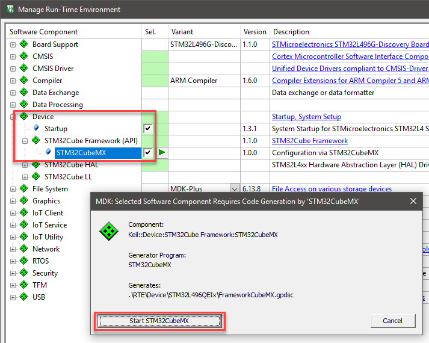

# Porting to Custom Hardware

This repository is a basic example for a Markdown based application note. It describes the process of porting hardware and software running on a development board to custom user hardware. This description is intended to help users to bridge the gap between starting with an example project (that they have downloaded from Solar) and their own bespoke hardware that they will finally ship to their customers.

## License

This application note is licensed under [Apache-2.0](https://www.apache.org/licenses/LICENSE-2.0).

# Example: Porting process starting from the B-L475E-IOT01A_BSP

The following describes how to port example code from an existing project for the [STMicroelectronics' B-L475E-IOT01A](https://www2.keil.com/iot/b-l475e-iot01a) to another device from the same device family that is mounted on some custom hardware.

The starting point of this effort is the [platform example project](https://github.com/MDK-Packs/B-L475E-IOT01A_BSP/tree/develop/Projects/Platform) for the B-L475E-IOT01A.

## Start with the existing project

Download and open existing the [platform example project](https://github.com/MDK-Packs/B-L475E-IOT01A_BSP/tree/develop/Projects/Platform). Once opened, go to **Project - Options for Target 'B-L475E-IOT01A'** (or press Alt+F7) and select the **Device** tab. Change the selected device from STM32L475VGTx to STM32L496QEIx and click OK:


Next, the **Manage Run-Time Environment** window opens which asks you to remove unavailable components or to exchange them with available ones:

- Expand the **Board Support:Drivers** group and deselect *all* components.
- Expand **CMSIS Driver:VIO (API)** group and deselect *Board* component.
- Click OK:

  

- Close the project in µVision.

Before continuing, you should remove the previously generated files from STM32CubeMX. Afterwards, you will create new ones for the new target device.

Using your file manager, navigate to the project's subfolder `./RTE/Device` and delete the folder *STM32L475VGTx*.

Switch back to µVision and reopen the project (from the **Project** menu item).

Go to **Project - Manage - Run-Time Environment** and expand **Device:STM32Cube Framework (API)**. Enable *STM32CubeMX* and click OK. An new window will ask to launch STM32CubeMX:



Pressing the **Start STM32CubeMX** button will launch the application and preconfigure it for the new target device:


## Device Configuration in STM32CubeMX

For details about device configuration with STM32CubeMX, consult the online help of the tool itself. Here's the minimal configuration that you need to do to continue with your custom project:

- On the **Pinout & Configuration** tab, configure the required peripherals under **System Core**, **Connectivity** etc.
  - Under **System Core** select *NVIC* and switch to the **Code generation** tab.
  - Clear the **Generate IRQ handler** checkbox for *System service call...*, *Pendable request...* and *Time base...*:
    
- On the **Clock Configuration** tab, configure system and peripheral clocks as required by your application.
- On the **Project Manager** tab, select the **Code Generator**.
  - Under **STM32Cube MCU packages and embedded software packs** select *Add necessary library files...*:
    
- Press **GENERATE CODE**.
- Press Close when the code generation notification dialog opens:
  
- You can safely close STM32CubeMX now.
- Return to µVision and click the OK button to import the changes:

  

## Work on the Source Code in µVision

### Add Source Code to the Project

Open the source file containing the `main` application entry function and add the following `#include` statements:

```C
#include "cmsis_os2.h"
#include "RTE_Components.h"
#if defined(RTE_Compiler_EventRecorder)
#include "EventRecorder.h"
#endif
```

In `main`, add the following code:

- Configure system clocks and update system clock variable (add following code snippet):

```C
  /* Update SystemCoreClock variable */
  SystemCoreClockUpdate();
```

- Initialize Event Recorder (add following code snippet):

```C
#if defined(RTE_Compiler_EventRecorder) && \
    (defined(__MICROLIB) || \
    !(defined(RTE_CMSIS_RTOS2_RTX5) || defined(RTE_CMSIS_RTOS2_FreeRTOS)))
  EventRecorderInitialize(EventRecordAll, 1U);
#endif
```

- To start the CMSIS-RTOS2 kernel, add following code snippet:

```C
  osKernelInitialize();                         /* Initialize CMSIS-RTOS2 */
  app_initialize();                             /* Initialize application */
  osKernelStart();                              /* Start thread execution */
```

### Remove Unnecessary Files and Select Appropriate Components

In the **Project** window, right-click on *Board IO* and select *Remove Group 'Board IO' and its Files* to delete this group from the target:
 

Go to **Project - Manage - Run-Time Environment** and expand **Compiler:I/O:** to reconfigure the retargetting of the C library's STDIO:
- STDERR component: select ITM variant
- STDIN component: select ITM variant
- STDOUT component: select ITM variant


Expand the **CMSIS Driver** group and select/deselect the required drivers for the interfaces that you are using in your custom application, for example I2C, MCI, SPI, USART, VIO, WiFi.

Finally, resolve the dependencies (press the *Resolve* button) and/or select components that are shown in the **Validation Output** window.

Press OK to close the **Manage Run-Time Environment** window:


### Driver Configuration

Ensure that CMSIS Drivers are configured as specified. The documentation is accessible via the **Manage Run-Time Environment** window under the *Device::STM32Cube Framework(API)* component (check the Description column). Refer to the chapter: STM32L4 CMSIS-Drivers Configuration documentation.

### Other Configuration

Configure the µVision project as you are used to for other development projects. For example, set compiler options,configure the debugger, and set stack and heap as required by the application. Do not forget to [locate Event Recorder in uninitialized memory](https://www.keil.com/pack/doc/compiler/EventRecorder/html/er_use.html#place_uninit_memory).
