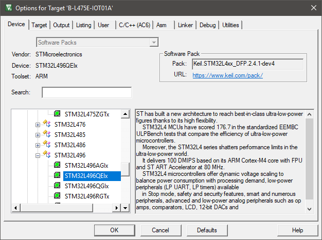
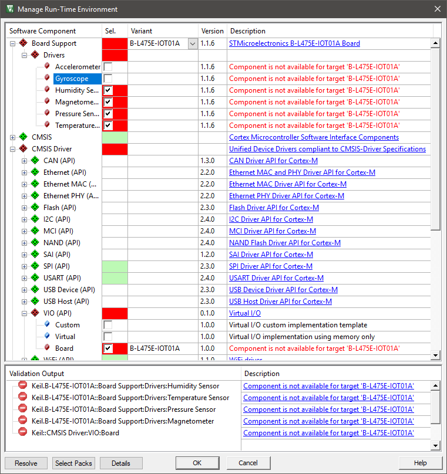
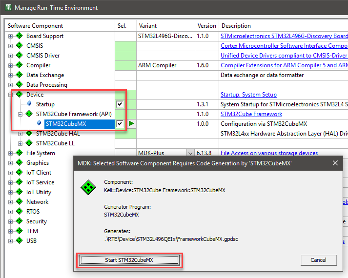

# Migrate STM32 Based Example Projects to Custom Hardware

This section describes the porting process of software example projects that run on an STMicroelectronics development board (i.e. Nucleo or Discovery) to custom hardware that uses the same or a similar device from the same microcontroller family.

In the following steps, the software example project was initally running on the STMicroelectronics B-L475E-IOT01A evaluation board. The custom hardware uses a slightly different device from the STM32L4 series, in this case the STM32L496QEIx and does not offer the demo hardware (button, LED, and sensors). In the software example project the board peripherals are connected via the [CMSIS-Driver VIO](https://arm-software.github.io/CMSIS_5/Driver/html/group__vio__interface__gr.html).

## Required Steps

Porting to a new device and/or your custom hardware is done in these steps:

1. [Change device selection to match the new target hardware](#change-target-device)
2. [Remove board specific software components](#remove-unavailable-components)
3. [Configure or import device setup with STM32CubeMX](#configure-in-stm32cubemx)
4. [Update generated code](#update-generated-code)
5. [Configure in µVision](#configure-in-µVision)


## Change Target Device

In the µVision project open the dialog **Project - Options for Target - Device** and change the device selection to your new target device (here: STM32L496QEIx).



## Remove Unavailable Components 

Open **Project - Manage - Run-Time Environment** that shows the software component selection.  The **Board Support** software components related to the board I/O components. These components interface via the [CMSIS-Driver VIO](https://arm-software.github.io/CMSIS_5/Driver/html/group__vio__interface__gr.html) to the demo application. Depending on the device selection, the board I/O components might be flag red to indicate that they are not available.



- Disable *all* components that belong to the **Board Support** software components.
- Change the selection for the [CMSIS-Driver VIO](https://arm-software.github.io/CMSIS_5/Driver/html/group__vio__interface__gr.html) from **Board** to **Virtual** or **Costom**.  For the selection **Costom** you should create a custom implementation of a CMSIS-Driver VIO.

## Configure in STM32CubeMX

Before continuing, you need to rename the previously generated GPDSC file so that µVision creates a new one for the updated target device. This procedure will remove the entries in the `/* USER CODE */` sections of the files that are generated and editable. If you wish to keep these code snippets, make sure to save your work somewhere else.

Using your file manager, navigate to the project's subfolder `./RTE/Device/previous_target` and rename the file `FrameworkCubeMX.gpdsc` to `FrameworkCubeMX.gpdsc.bak`.

Switch back to µVision and reopen the project (from the **Project** menu item).

Go to **Project - Manage - Run-Time Environment** and expand **Device:STM32Cube Framework (API)**. Enable *STM32CubeMX* and click OK. An new window will ask to launch STM32CubeMX.:



Pressing the **Start STM32CubeMX** button will launch the application and preconfigure it for the new target device. Configure the device as described in the [STM32Cube documentation](https://www.keil.com/pack/doc/STM32Cube/html/cubemx_using.html#cubemx_sys_config). You can also try to import the configuration of the previous device using STM32CubeMX' import menu. Load the file `STCubeGenerated.ioc` from the directory `./RTE/Device/previous_target/STCubeGenerated`.

Once done, switch back to µVision.

## Update Generated Code

In the previous step, it was mentioned that the user code in the generated files needs to be saved so that it can be reapplied now. For most example projects, the following is required to be added to the `main.c` file in the group **STM32CubeMX:Common Sources**:

Add the following `#include` statements:

```C
#include "cmsis_os2.h"
#include "RTE_Components.h"
#if defined(RTE_Compiler_EventRecorder)
#include "EventRecorder.h"
#endif
```

Add the following code:

- Configure system clocks and update system clock variable (add following code snippet):

```C
  /* Update SystemCoreClock variable */
  SystemCoreClockUpdate();
```

- Initialize Event Recorder (add following code snippet):

```C
#if defined(RTE_Compiler_EventRecorder) && \
    (defined(__MICROLIB) || \
    !(defined(RTE_CMSIS_RTOS2_RTX5) || defined(RTE_CMSIS_RTOS2_FreeRTOS)))
  EventRecorderInitialize(EventRecordAll, 1U);
#endif
```

- To start the CMSIS-RTOS2 kernel, add following code snippet:

```C
  osKernelInitialize();                         /* Initialize CMSIS-RTOS2 */
  app_initialize();                             /* Initialize application */
  osKernelStart();                              /* Start thread execution */
```

If in doubt, check the copy of the old generated files using a file compare tool.

## Configure in µVision

Finally, you need to configure the project to your needs. There's no general rule here what to do, but here are a couple of items that you can check:

- In the **Project** window, remove unnecessary files (not generated by STM32CubeMX, but added manually).
- In the **Manage Run-Time Environment** window:
  - Select appropriate software components (for example check the selected retargeting method under **Compiler:I/O:**).
  - Add required CMSIS-Drivers under the **CMSIS Driver** group (for example I2C, MCI, SPI, USART, VIO, WiFi).
- Ensure that CMSIS-Drivers are configured as specified. The documentation is accessible via the **Manage Run-Time Environment** window under the *Device::STM32Cube Framework(API)* component (check the **Description** column). Refer to the chapter: STM32L4 CMSIS-Drivers Configuration documentation.
- Configure the µVision project as you are used to for other development projects. For example, set compiler options,configure the debugger, and set stack and heap as required by the application. Do not forget to [locate Event Recorder in uninitialized memory](https://www.keil.com/pack/doc/compiler/EventRecorder/html/er_use.html#place_uninit_memory).
