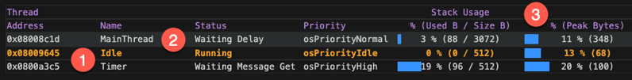

# Project standards

The following describes best practices on how to set up an example/demo project so that it can be used best in Keil
Studio.

## Essential files

At the top-level of your directory structure:

- Always add a `README.md` file that describes the project with its set up and required HW settings to run it.
- Have a `vcpkg-configuration.json` file, even if you have multiple solutions/projects below. This will ensure that the
  correct tools are loaded for the example.
- When creating or updating an example project, make sure to use the latest `.gitignore` file from the CMSIS Solution
  extension. You will find it on your PC in `~/.vscode/extensions/arm.cmsis-csolution-X.Y.Z/templates/git`.
- When under Apache 2.0 license, add the [LICENSE](./LICENSE) file.
- You might want to add a [`.vscode/extensions.json`](./extensions.json) file which triggers the installation of the
  required VS Code extensions.

## Code recommendations

For a nice RTOS view in Keil Studio, such as this:



Keil RTX-based example projects should always have the following:

1. In the `cproject.yml` file, add this to get a nice naming of the idle and timer threads:

   ```yml
   # Project define
   define:
     - OS_IDLE_THREAD_NAME: \"Idle\"
     - OS_TIMER_THREAD_NAME: \"Timer\"
   ```

2. Thread names via an `osTreadAttr_t` in C source files:

   ```c
   // Create thread attribute to show thread name in the XRTOS viewer:
   const osThreadAttr_t app_main_attr = {.name = "MainThread"};
   ```

3. Enable stack watermarking in `RTX_Config.h`:

   ```c
   #define OS_STACK_WATERMARK          1
   ```
## VS Code files

In stand-alone repositories that contain only one or more examples, a `.vscode/extensions.json` file with the
following content should be added:

```json
{
    "recommendations": [
        "arm.keil-studio-pack"
    ]
}
```

## GitHub specifics

This section describes the contents of a GitHub repository.

### Workflows

1. If the content of the repository is a CMSIS-Pack, a workflow generating the pack should be present. A good example
   is available in
   [`pack.yml`](https://github.com/Open-CMSIS-Pack/DFP-Pack-HandsOn/blob/main/.github/workflows/pack.yml).
2. Ensure that a project can be built using a
   [`build.yml`](https://github.com/Arm-Examples/Hello_B-U585I-IOT02A/blob/main/.github/workflows/build.yml) file.
