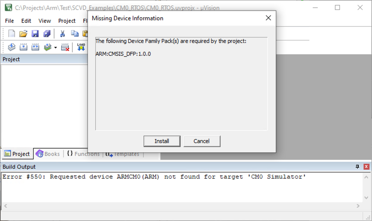
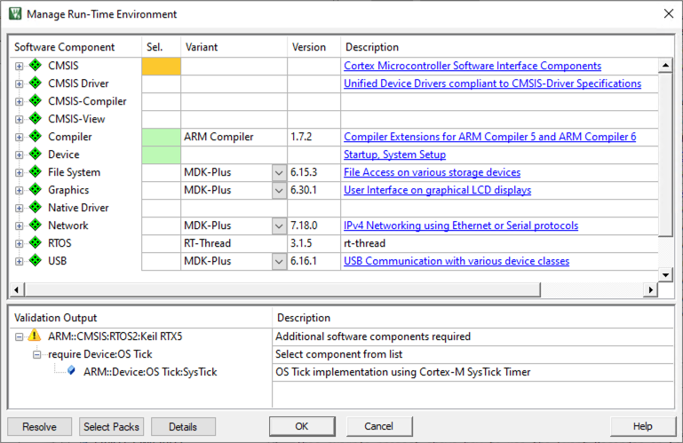
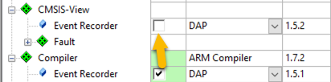
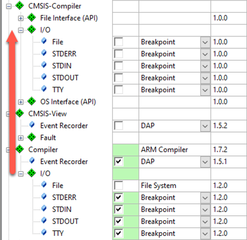

# Migrating CMSIS-based projects from CMSIS v5 to CMSIS v6

This migration guide describes what is necessary to move CMSIS-based projects from CMSIS v5 to CMSIS v6. It explains which packs you need to install, which components to choose, and how to handle the most common errors.

## Supported toolchains

CMSIS v6 supports the following toolchains.

- [Arm Compiler for Embedded (v6 and above)](https://developer.arm.com/Tools%20and%20Software/Arm%20Compiler%20for%20Embedded)
- [Arm GNU Toolchain (v12 and above)](https://developer.arm.com/Tools%20and%20Software/GNU%20Toolchain)
- [LLVM Toolchain (v16 and above)](https://developer.arm.com/Tools%20and%20Software/LLVM%20Toolchain)
- [IAR Embedded Workbench for Arm (v9.30 and above)](https://www.iar.com/ewarm)

> *Note*  
> The usage of Arm Compiler v5 is not supported! The [Arm Compiler for Embedded Migration and Compatibility Guide](https://developer.arm.com/documentation/100068/latest/Migrating-from-Arm-Compiler-5-to-Arm-Compiler-for-Embedded-6) helps migrating your project to Arm Compiler for Embedded v6.

## Required CMSIS-Packs

For a successful migration, please install the following packs on your system.

### Migrating from CMSIS v5 to v6

- [ARM.CMSIS.6.0.0.pack](https://www.keil.com/pack/ARM.CMSIS.6.0.0.pack)
- [ARM.CMSIS_DFP.1.0.0.pack](https://www.keil.com/pack/ARM.CMSIS_DFP.1.0.0.pack)
- [ARM.CMSIS-RTX.1.0.0.pack](https://www.keil.com/pack/ARM.CMSIS-RTX.1.0.0.pack)

### Migrating components from Keil.ARM_C0mpiler pack

- [ARM.CMSIS-View.1.0.0.pack](https://www.keil.com/pack/ARM.CMSIS-View.1.0.0.pack)
- [ARM.CMSIS_Compiler.1.0.0.pack](https://www.keil.com/pack/ARM.CMSIS_Compiler.1.0.0.pack)

> *Note*  
> The pack versions are minimum versions.

## Device mapping

If you are using an Arm device from the CMSIS v5 pack, you need to switch the device selection to one of the supported devices in the new CMSIS_DFP pack. The following table shows the available mappings.

| CMSIS v5                                                   | CMSIS-DFP |
|------------------------------------------------------------|-----------|
| ARMCM0                                                     | ARMCM0 (NO_FPU, NO_MPU) |
| ARMCM0P, ARMCM0P_MPU                                       | ARMCM0P (NO_FPU, MPU) |
| ARMCM1                                                     | ARMCM1 (NO_FPU, NO_MPU) |
| ARMCM3                                                     | ARMCM3 (NO_FPU, MPU) |
| ARMCM4, ARMCM4_FP                                          | ARMCM4 (SP_FPU, MPU) |
| ARMCM7, ARMCM7_SP, ARMCM7_DP                               | ARMCM7 (DP_FPU, MPU) |
| ARMCM23, ARMCM23_TZ                                        | ARMCM23 (NO_FPU, MPU, TZ) |
| ARMCM33, ARMCM33_TZ, ARMCM33_DSP_FP, ARMCM33_DSP_FP_TZ     | ARMCM33 (SP_FPU, MPU, DSP, TZ) |
| ARMCM35P, ARMCM35P_TZ, ARMCM35P_DSP_FP, ARMCM35P_DSP_FP_TZ | ARMCM35P (SP_FPU, MPU, DSP, TZ) |
| ARMCM55                                                    | ARMCM55 (DP_FPU, MPU, FP_MVE, DSP, TZ) |
| ARMCM85                                                    | ARMCM85 (PACBTI, MPU, DP_FPU, FP_MVE, DSP, TZ) |
| ARMSC000                                                   | ARMSC000 (NO_FPU, NO_MPU) |
| ARMSC300                                                   | ARMSC300 (NO_FPU, NO_MPU) |

> *Note*  
> To reduce the functionality of the new superset devices, use respective compiler flags. Please consult the manual of your toolchain how to do so.

## Troubleshooting

This section shows the most common errors and shows possible resolutions.

### Missing device

The following error occurs when you try to migrate a project to CMSIS v6, but you have not installed the CMSIS_DFP pack:

*Resolution:* Install [ARM.CMSIS_DFP.1.0.0.pack](https://www.keil.com/pack/ARM.CMSIS_DFP_.1.0.0.pack) or above.

### Error instantiating RTE components

The following error occurs when you try to migrate a Keil RTX-based project, but you have not installed the CMSIS-RTX pack:

*Resolution:* Install [ARM.CMSIS-RTX.1.0.0.pack](https://www.keil.com/pack/ARM.CMSIS-RTX.1.0.0.pack) or above.

### Missing software components

The following warning is shown in the Validation Output window when you try to migrate a Keil RTX-based project:

*Resolution:* Use the **Resolve** button to select the missing component automatically.

### Manual migration from Keil.ARM_Compiler pack

As the components from the Keil.ARM_Compiler pack do not have 1:1 replacements, you need to deselect the old components and select the replacements from the two new packs (ARM.Compiler and ARM.CMSIS-View).

1. Compiler:EventRecorder migration

   Deselect the `Compiler:Event Recorder` component and select the `CMSIS-View:Event Recorder` component:

   
1. Compiler:I/O migration

   Deselect any component of `Compiler:I/O` and select the corresponding `CMSIS-View:I/O` component:

   

## Project file migration

The following section is only relevant to users of Keil MDK v5. It explains how to migrate from a uvprojx-based project file to the new Open-CMSIS-Pack csolution project file format.

The learning path [Convert uvprojx-based projects to csolution](https://learn.arm.com/learning-paths/microcontrollers/uvprojx-conversion/) explains how to import, convert, and build uvprojx-based projects in [Keil Studio for VS Code](https://learn.arm.com/install-guides/keilstudio_vs/). It also shows how to convert and build uvprojx-based projects on the command line.
