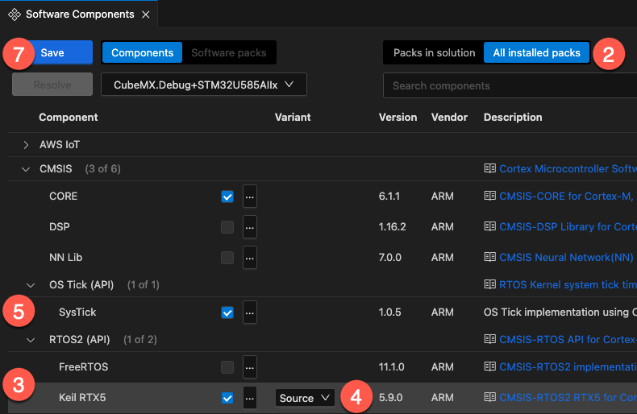
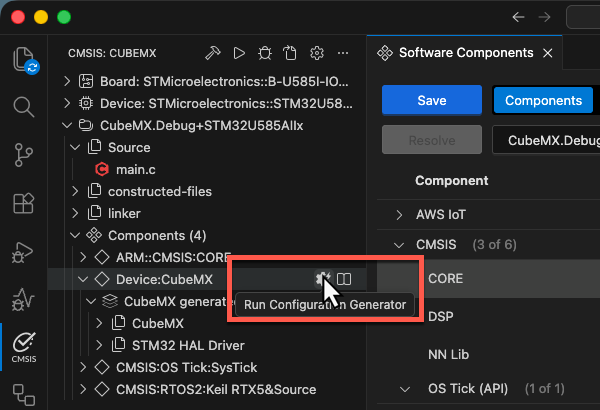
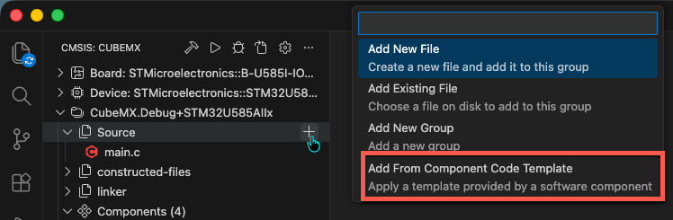
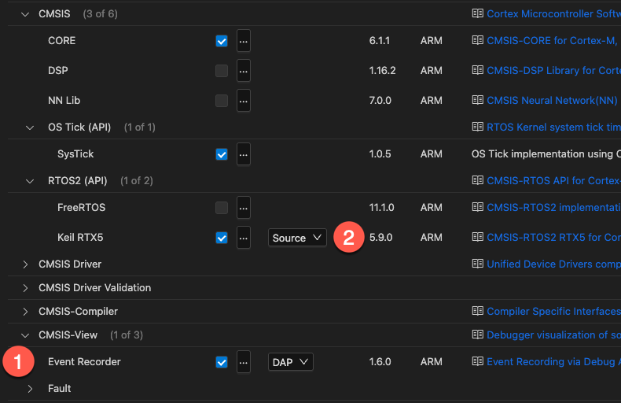

# Adding an RTOS to a basic project

This guide assume that you have created a basic CMSIS solution for your device/board that does not contain a real-time
operating system (RTOS). It goes step-by-step through the process of adding the RTOS to the existing CMSIS solution.

## Add software components

Follow these steps to add an RTOS to your project.

1. From the **CMSIS** view, open the **Manage Software Components** window.
2. At the top left corner, select "All installed packs".
3. Expand **CMSIS - RTOS2 (API)** and select either **FreeRTOS** or **Keil RTX5** (this guide will continue with the
   latter).
4. [Optional] For Keil RTX5, you can choose to either add it as a library (Variant: **Library**) or to add the full
   source code (Variant: **Source**). The latter is required if you want to use
   [Event Recorder](#add-event-recorder-visibility-optional).
5. Expand **CMSIS - OS Tick (API)** and enable **SysTick**.
6. If you see any validation issues, please fix them before continuing.
7. Click **Save**.



In the **CMSIS** view, you will see the files that have been automatically added to your project, such as
`RTX_Config.h`, `RTX_Config.c`, as well as the library or the source code files.

## STM32CubeMX specific settings

For STM32 devices, STM32CubeMX implements interrupt functions for all Cortex-M exception handlers. However, some
exception handlers are typically required for the RTOS kernel execution.

Configure the interrupt handlers by opening STM32CubeMX from the **CMSIS** view:



Open the dialog **Pinout & Configuration - System Core - NVIC - Code generation**. Disable *Generate IRQ handler* for:

- System service call via SWI instruction
- Pendable request for system service
- System tick timer


Then, click the button `GENERATE CODE` to update the generated files in the directory `STM32CubeMX/<device>`.

## RTOS source code and setup

### Add code templates

You can add template files to the project by adding a new source group to the CMSIS solution and then adding a new file
(**Add from Component Code Template**). For Keil RTX, you can add templates for the `main` function, events, memory
pools, messages queues, mutexes, semaphores, thread, timers, and SVC user tables.



### Add support for RTX specific functions (optional)

RTX5 adds a couple of functions for the idle more, for error notifications, and special system timer functions. It is
also using macros for control block and memory sizes.

If you require some of the
[RTX specific functions](https://arm-software.github.io/CMSIS-RTX/latest/group__rtx5__specific__functions.html) in your
application code, include the header file `rtx_os.h`.

```c
#include "rtx_os.h"
```

This enables [low-power](https://arm-software.github.io/CMSIS-RTX/latest/theory_of_operation.html#lowPower) and
[tick-less](https://arm-software.github.io/CMSIS-RTX/latest/theory_of_operation.html#TickLess) operation modes.

### Configure Keil RTX5

The file `RTX_Config.h` defines the configuration parameters of Keil RTX5 and is part of every project that is using
the kernel. [Configure](https://arm-software.github.io/CMSIS-RTX/latest/config_rtx5.html) it to the application's
needs.

### Add Event Recorder Visibility (optional)

Keil RTX5 interfaces to the [Event Recorder](https://arm-software.github.io/CMSIS-View/latest/evr.html) to provide
event information which helps you to understand and analyze the operation.

To use the Event Recorder together with RTX5:

1. Select the software component **CMSIS-View:Event Recorder**.
2. Select the **Source** variant of the software component **CMSIS:RTOS2 (API):Keil RTX5**.



- Enable the related settings in the `RTX_Config.h` file under
  [Event Recorder](https://arm-software.github.io/CMSIS-RTX/latest/config_rtx5.html#evtrecConfig).
- Build the application code and download it to the debug hardware.

<!-- Once the target application generates event information, it can be viewed in the CMSIS debugger using the
EventRecorder. -->

## Further reading

The [tutorial](https://arm-software.github.io/CMSIS-RTX/latest/rtos2_tutorial.html) is a good place to start learning
more about the capabilities of Keil RTX5.
