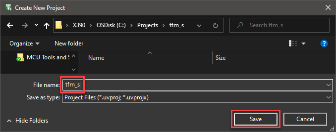
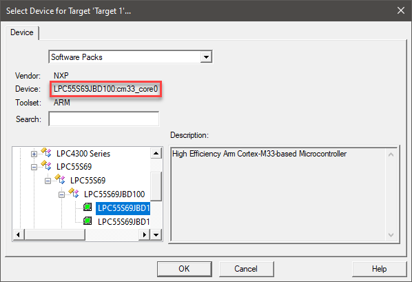
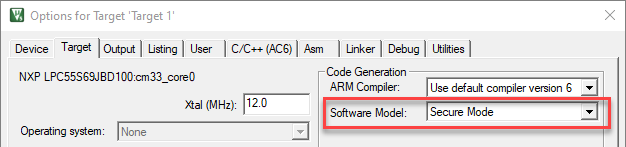
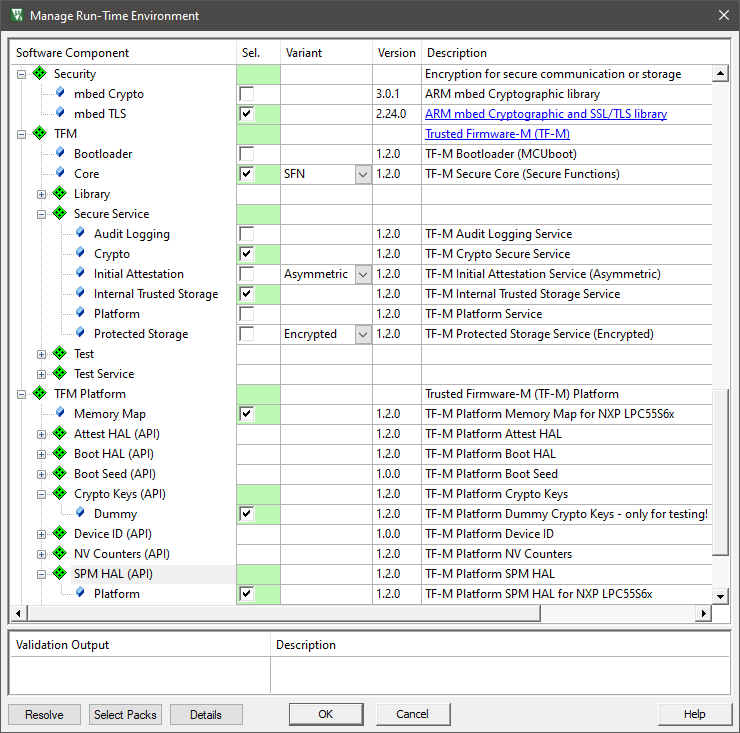
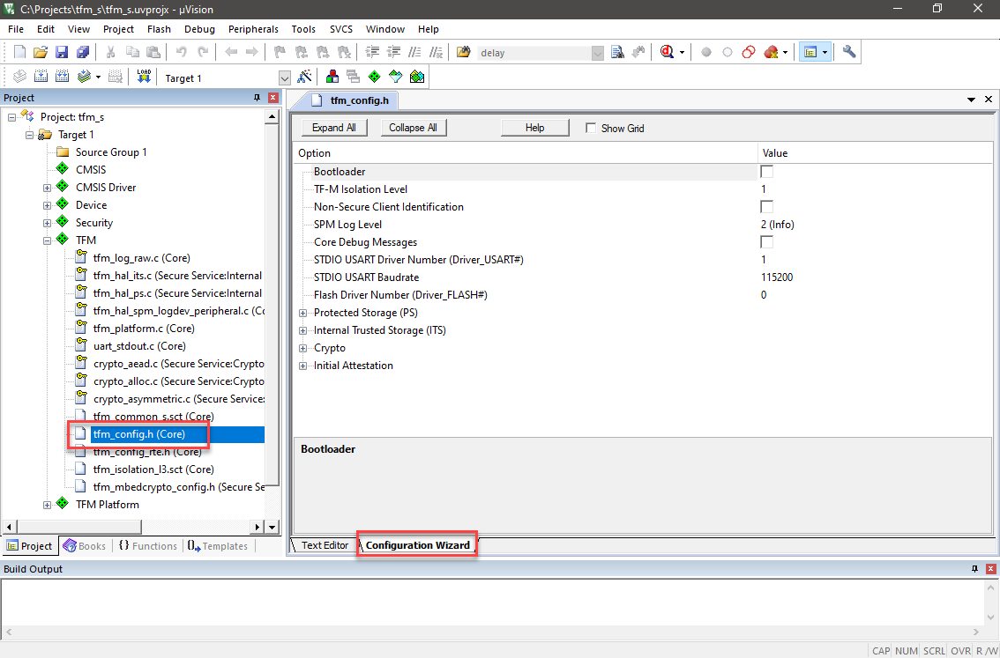
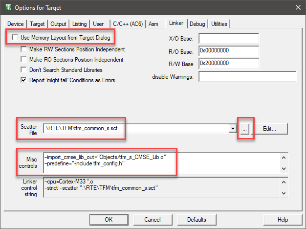
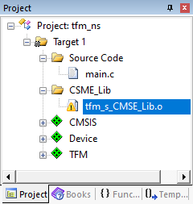
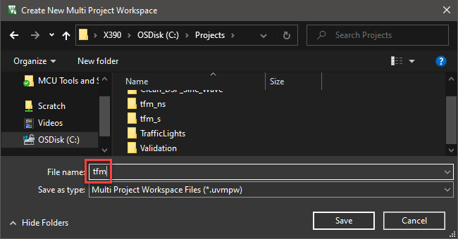
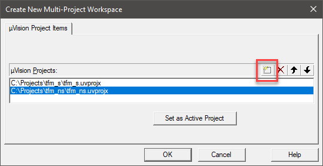
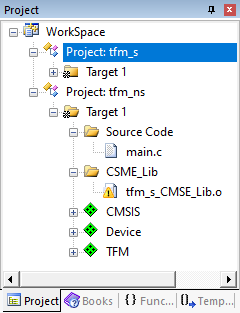

# Create TF-M projects

The purpose of this tutorial is to show you how to set up projects using the TF-M CMSIS-Pack in μVision. At the end of this tutorial, you will be able to create a project from scratch of start with an example project provided in a platform pack. This tutorial uses the NXP LPCXpresso55S69 development board as an example, but it can be recreated with any other supported Armv8-M based platform as well.

## Prerequisites

The tutorial requires you to install the following software:
- [Install MDK](https://www2.keil.com/mdk5/install)
- Using **Pack Installer**, add the following software packs to your computer:
  - ARM:TFM (min. v2.1.0)
  - ARM:PSA (min. v1.0.0)
  - ARM:mbedTLS (min. v1.7.0)
  - A device specific TF-M platform pack (for example: Keil.LPC55S6x_TFM-PF).

## Introduction

A TF-M application always consists of at least two µVision projects. A secure project that contains all the services offered by TF-M and a non-secure projects that uses these services. In the following, the creation of both projects will be shown and how to combine them in a multi-project workspace to keep them together. Finally, already pre-built example projects that can be used as a starting point are discussed.

## Create secure and non-secure projects

The following shows how to create a secure and non-secure project that use certain TF-M services. In this case, the secure side uses the "Crypto" and "Internal Trusted Storage" services, while the non-secure side uses the "Crypto" service. Note that in your application you might want to use other/additional services. In that case select the appropriate software components. 

### Create a secure project

Open µVision and go to **Project - New µVision Project...**. Select an empty folder and enter the project name, for example, *tfm_s*. Click Save:



In the next window, select your target device (here: NXP LPC55S69JBD100:cm33_core0) and click OK:



Click *Cancel* on the upcoming Manage Run-Time Environment window. Before selecting the software components, you need to set the correct software model.

 Go to **Project - Options for Target 'Target1'...**. On the **Target** tab, change the **Software Model** to *Secure Mode* and click OK:



**Select software components**

 Go to **Project - Manage - Run-Time Environment...** to select the software components used in the project. Select the following components:

- TFM:Core(SFN)
- TFM Platform:Crypto Keys (API):Dummy
- TFM Platform:Memory Map
- TFM Platform:SPM HAL (API):Platform
- TFM:Secure Service:Crypto [could start to resolve then and only add the Flash driver]
- TFM:Secure Service: Internal Trusted Storage
- Security:mbed TLS
- CMSIS Driver: USART (API):flexcomm_usart_cmsis
- CMSIS:CORE
- CMSIS Driver:Flash:Custom

Use the **Resolve** button to add the other required components, then click OK:



**Configure software components**

For the correct operation, you need to configure some of the software components. In the Project window, browse to the **TFM** component and double-click `tfm_config.h` and use the **Configuration Wizard** view to configure TF-M:



Other configuration files in the **TFM Platform** component are the following:

- mem_layout.h
- tz_sau_nvic.c
- tz_mpc_ppc.c
- tz_config.h

These files are created by [CMSIS-Zone](https://arm-software.github.io/CMSIS_5/Zone/html/index.html) and part of the device platform pack. You can either edit them manually or use CMSIS-Zone to recreate them.

**Configure the rest of the system**

Finally, before creating the actual application, you need to point the Arm Compiler to the correct linker script.

 Go to **Project - Options for Target 'Target1'...**. On the **Linker** tab, unselect **Use Memory Layout from Target Dialog** and click on the three dots next to **Edit**. Browse to `.\RTE\TFM` and select `tfm_common_s.sct`. Click OK:



On the same tab, you need to set some **Misc controls** as well. There is no general rule for this, but it should look like the following:
```
--import_cmse_lib_out="<object_directory>/tfm_s_CMSE_Lib.o"
--predefine="-include tfm_config.h"
--predefine="-include tfm_config_rte.h"
--predefine="-IRTE/_<target_name>/"
--predefine="-IRTE/TFM_Platform/<device_name>/"
```
The first line is to generate the CMSE veneers which needs to be included on the non-secure project. Usually, the `<object_directory>` is `./Objects`. Note that the `<target name>` with prefix `’_’` needs to be used and also the `<device_name>`. In this particular case, add:

```
--import_cmse_lib_out="Objects/tfm_s_CMSE_Lib.o"
--predefine="-include tfm_config.h"
--predefine="-include tfm_config_rte.h"
--predefine="-IRTE/_LPCXpresso55S69/"
--predefine="-IRTE/TFM_Platform/LPC55S69JBD100_cm33_core0/"
```

**Configure the device**

Finally, configure the device and its drivers using either `RTE_Device.h` file of designated configuration tools such as MCUXpresso or STM32CubeMX.

This step concludes the setup and configuration of the secure project.

### Create a non-secure project

Open µVision and go to **Project - New µVision Project...**. Select an empty folder and enter the project name, for example, *tfm_ns*. Click Save.

In the next window, select your target device (here: NXP LPC55S69JBD100:cm33_core0) and click OK.

**Select software components**

As there is no configuration of the software model required, you can directly select the required software components:

- TFM:API:Crypto
- TFM:Core(SFN)
- CMSIS:CORE
- CMSIS:RTOS2 (either FreeRTOS or Keil RTX5)

Resolve to add the other required components and click OK.

**Configure software components**

The selected software components do not require further configuration.

**Configure the rest of the system**

As the non-secure application consumes the services offered by the secure application, the CMSE library that is generated by the secure side needs to be added to the non-secure side. 

In the **Project** window, right-click on **Target 1** and select **Add Group...**. Create a new group called **CMSE_Lib**. Right-click on **CMSE_Lib** and select **Add Existing Files to Group 'CMSE_Lib'...** and browse to the secure project's `.\Object` directory and add `tfm_s_CMSE_Lib.o`:



Finally, before creating the actual application, you need to point the Arm Compiler to the correct linker script.

 Go to **Project - Options for Target 'Target1'...**. On the **Linker** tab, unselect **Use Memory Layout from Target Dialog** and click on the three dots next to **Edit**. Browse to `.\RTE\Device\LPC55S69JBD100_cm33_core0` and select `LPC55S69_cm33_core0_flash.scf`. Click OK.

## Create a multi-project workspace

A multi-project workspace helps to manage more than one project in a single µVision project environment. In the steps above, you have created a µVision project for each part of the TF-M project which you can include into a multi-project workspace. 

Close the current project and then go to **Project – New Multi-Project Workspace...**. Enter a meaningful name and click Save:



In the **Create New Multi-Project Workspace** window, add the two projects using the  **New (Insert)** icon and click OK:



The Project window shows both projects:



## Pre-built example projects

The previous sections have shown how to start TF-M based projects from scratch. If you want to start right away, use one of the out-of-the-box examples that are included in the the platform packs of the supported devices as a starting point:

- The **TF-M** Project Template consists of the secure and non-secure projects as described above.
- The **TF-M with Bootloader** Project Template adds the TF-M bootloader component.
