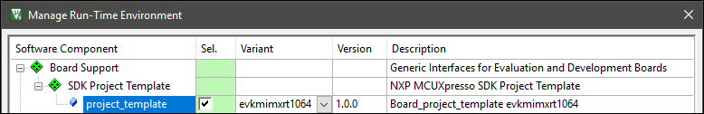
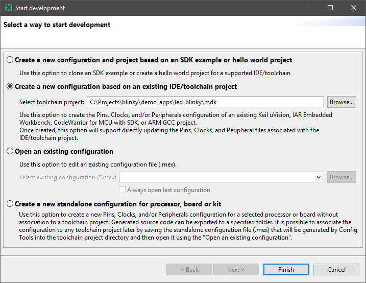
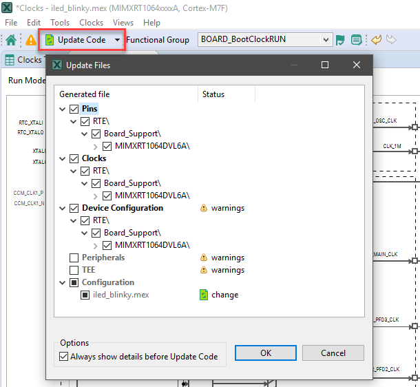

# Configuring Example Projects with MCUXpresso Config Tools

This tutorial explains how to modify an example project's configuration of an NXP device using MCUXpresso Config Tools. It assumes that the board support software component "*project_template*" is present in the example, which will be loaded into MCUXpresso for further configuration:

## In MCUXpresso Config Tools

In MCUXpresso Config Tools, go to **File - New** and select the *Create a new configuration based on an existing IDE/toolchain project* option in the **Create a new configuration** window. Provide the path to the example project and press **Finish**:

Once loaded, the configuration view opens. It shows the configuration as loaded from the SDK project template files that are located in the example project.

Configure the project as required (refer to the [MCUXpresso documentation](https://mcuxpresso.nxp.com/en/welcome#dev-resources) for more information). Once done, press the **Update Code** button to regenerate the configuration in the project directory. MCUXpresso shows which files will be updated:

Press **OK** to generate the code. MCXUpresso also creates a *\*.mex* file that can be used to revisit the tool for further configuration at a later stage.

## In the IDE

Go back to your development tool and continue to work on the project.
